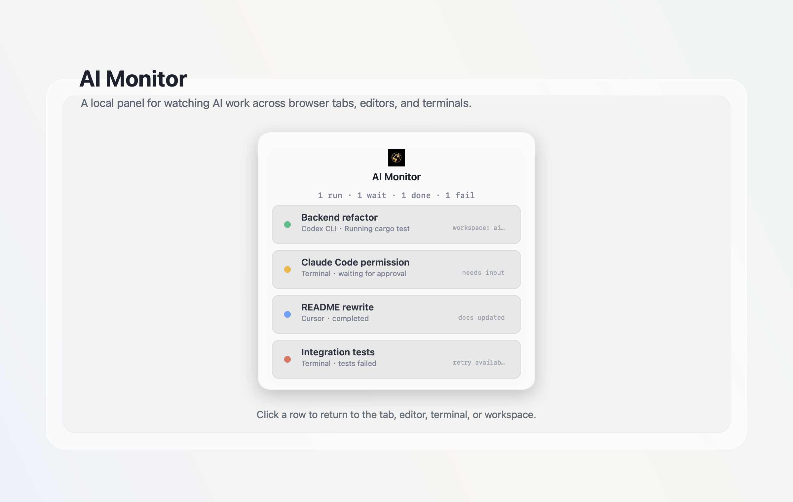
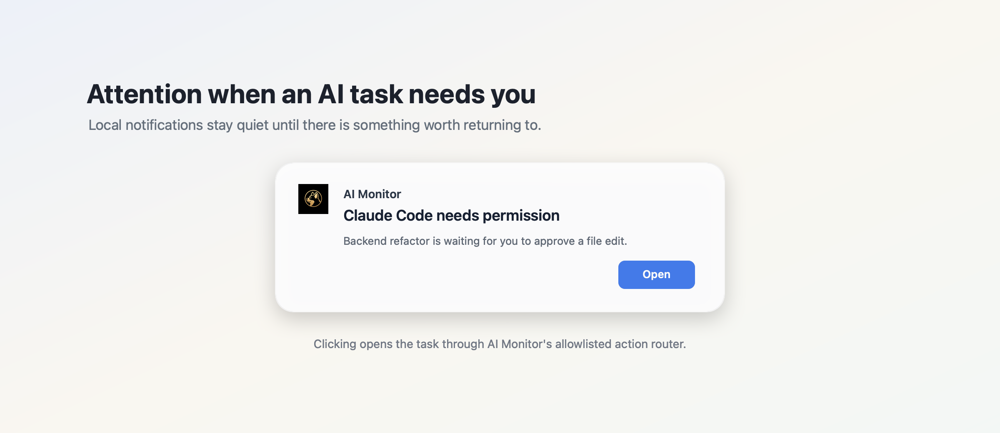

# AI Monitor

[English](README.md) | [简体中文](README.zh-CN.md)

AI Monitor 是一个本地 macOS 悬浮面板，用来集中查看你的 AI 工作状态。

当你同时开着多个 AI 工具时，AI Monitor 可以告诉你哪些任务正在运行、哪些已经完成、哪些失败了、哪些需要你输入。它也可以发送本地桌面通知，减少你反复检查浏览器、编辑器和终端窗口的次数。

## 系统要求

- macOS 13.0 或更高版本。
- 支持 Apple Silicon 和 Intel Mac。
- 暂不提供 Windows 和 Linux 桌面应用。

## 预览

## 下载

从 [GitHub Releases](https://github.com/notracc1210/ai-monitor-public/releases) 下载最新的 `AI Monitor.dmg`。

## 快速开始

1. 下载 `AI Monitor.dmg`。
2. 打开 DMG，把 `AI Monitor.app` 拖进 `/Applications`。
3. 从 `/Applications` 打开 `AI Monitor.app`。
4. 第一次启动会自动打开 Settings。
5. 点击 `Test connection`。如果显示 offline，点击 `Start daemon`，然后再测试一次。
6. 设置浏览器扩展时，使用 `Open browser install link` 和 `Copy API token`。

## 支持的输入来源

| 来源 | 支持情况 |
| --- | --- |
| 浏览器 | Chrome 扩展，支持 ChatGPT、Claude、Gemini、Perplexity、Grok 和 GitHub coding-agent 页面。 |
| IDE | VS Code 和 Cursor 扩展。 |
| 终端 | 支持 shell 命令、Claude Code hooks 和 Codex CLI hooks 的终端集成。 |
| 桌面应用观察器 | 可选的 macOS Accessibility 观察器，默认关闭。 |

## 通知

默认使用本地桌面通知。第三方通知服务是可选功能，只有在你主动到 Settings 里配置之后才会使用。

macOS 通知权限只会在 AI Monitor 第一次需要发送本地提醒时申请。

## 隐私

AI Monitor 默认本地优先。任务状态保存在你的 Mac 上，本地 daemon 默认只监听 `127.0.0.1`。

更多说明见：[隐私](docs/privacy.md) 和 [安全](docs/security.md)。

## 帮助

- [排障](docs/troubleshooting.md)
- [卸载](docs/uninstall.md)
- [浏览器扩展隐私政策](docs/browser-extension-privacy-policy.md)

需要支持时，可以在这个仓库提交 GitHub Issue。
